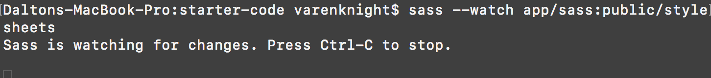

# Intro to Sass


### LEARNING OBJECTIVES
*After this lesson, you will be able to:*

- Have a clear understanding of what Sass is and the benefits of writing in Sass.
- Will be able to develop a clean css workflow in Sass. 


### STUDENT PRE-WORK
*Before this lesson, you should already be able to:*

- Can write and understand clear CSS.
- Understand how variables and nesting works.  
- Can use cmd line to initialize and compile projects.

***

## Overview

#### What is Sass? 

Sass is an extension of CSS that adds power and elegance to the basic language. It allows you to use variables, nested rules, mixins, inline imports, and more, all with a fully CSS-compatible syntax. Sass helps keep large stylesheets well-organized, and get small stylesheets up and running quickly, particularly with the help of the Compass style library.

As you can see Sass can add alot of functionality to css to improve front end development life.

##### So let's get Sassy! 


## Common Myths

There are alot of common misconseptions about Sass but let us tackle the biggest ones.

- Sass will change the way I write css entirely
- Sass is messy code.
- Sass will make my site less compatible across browsers.

### The Truth

Sass is no different then standard css in 90% of its syntax. In fact Sass has devoted to be compatible with ALL versions of css. 

Here is standard css.

``` css 
    article{ font-family: helvetica; }
    article h1{ color: #333377;}
    article p{ color: #333377;}
    article p:hover{ color: #cc3333;}

```
And here is Sass.
```scss 
    $mainColor: #333377;
    
    article{
        font-family: helvetica;
        h1{ color: $mainColor;}
        p{ color: $mainColor;
        &:hover{ color: #cc3333;}
        }  
    }
    
```
As you can see Sass reads the same as standard css but instead of calling each parent container you can nest the children elements inside the css! So much cleaner to read alrady. 

Did you also notice the amazing $ symbol? We were able to save that color as a variable to call in our properties. This means we can from one location update multiple css elements! This is only a few of the way that Sass can help you step up your css game.

***

## How does Sass work?

Sass takes your written Scss file and compiles it into css to be used in your site. There are a couple ways to do this, but we will be showing you the simplest way in terminal. 

### Installation and Use

Sass can be installed globally via homebrew! 


#### In terminal run
```bash
$ brew install sass/sass/sass
```

This will allow us to run the Sass commands to compile the Sass into regular Css. You'll need to tell Sass which file to build from, and where to output CSS to. For example, running 

 ```bash 
 $ sass input.scss output.css 
 ``` 
 
 inside your project folder will take a single Sass file, input.scss, and compile that file to output.css.

You can also watch individual files or directories with the --watch flag. The watch flag tells Sass to watch your source files for changes, and re-compile CSS each time you save your Sass. If you wanted to watch (instead of manually build) your input.scss file, you'd just add the watch flag to your command, like so:

```bash
$ sass --watch input.scss output.css
```
If you are looking to do all of your Sass and css files together you can set the input and output as you directories. 
```
$ sass --watch app/sass:public/stylesheets
```
Once Sass is running you will see this.



***

## The Benefits of Being Sassy

Next we are going to break down the advantages that Sass brings to the table. 

### Variables 

Currently in css the only way to style several elements together is to either use an existing css library or manually style every element one at a time. Which is fine when you are working on a small project, but imagine the complications that arise when you have a large scale project and you have to update several places. 

To wrap our heads around this we will be looking at the Bulma Css file and how they went about using variables to streamline their css file. 

[Bulma Css](https://cdnjs.cloudflare.com/ajax/libs/bulma/0.7.1/css/bulma.css)

Now let's look how they established variables to quickly create themes with the same css base.

[Bulma Sass](https://bulma.io/documentation/customize/variables/)

#### Creating variables

With the power of variables you can store things like colors, font stacks, or any CSS value you think you'll want to reuse. Sass uses the $ symbol to make something a variable. Here's an example:

```scss

$primary-font: Helvetica, sans-serif;
$primary-color: #777;

body{
    font: $primary-font;
    color: $primary-color;
}

```


